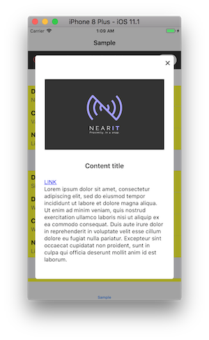
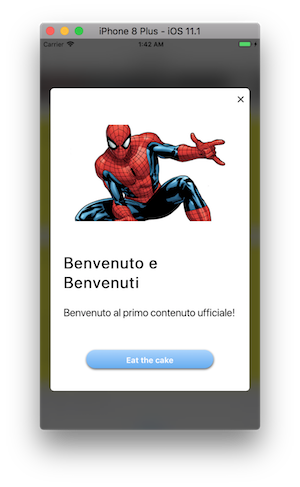
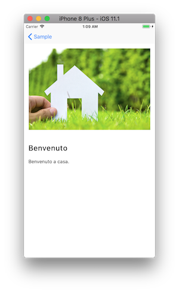

# NearIt-UI for content notification
#### Basic example
If you want your app to display a NearIT content in a pop-up dialog, use this simple code:

Swift version
```swift
// ...
let vc = NITContentViewController(content: content, trackingInfo: trackingInfo)
vc.show()

```

Objc version
```objc
// ...
NITContentViewController *vc = [[NITContentViewController alloc] initWithContent:content trackingInfo:trackingInfo];
[vc show];
```

where, `content` is an instance of NearIT SDK `Content` class. Further information on contents and other in-app content can be found [here](http://nearit-android.readthedocs.io/en/latest/in-app-content/).



When the user taps on the button, the link will be opened using the integrated `SFSafariViewController`. For more advanced uses the callback handler can be customized:

Swift version
```swift
vc.callToActionHandler = { (viewController, url) in
    // ...
}
```

Objc version
```objc
vc.callToActionHandler = ^(NITContentViewController *controller, NSURL *url) {
    // ...
}
```

Optionally, you can display the content in your `UINavigationController`:

Swift version
```swift
// ...
let vc = NITContentViewController(content: content)
vc.show(navigationController: navigationController!)
```

Objc version
```Objc
// ...
NITContentViewController *vc = [[NITContentViewController alloc] initWithContent:content];
[vc showWithNavigationController:self.navigationController];
```



## Advanced customizations

 By default all content `links` are allowed; a custom link handler can be customized to restrict this behaviour:

Swift version
```swift
vc.linkHandler = { (controller, request) -> WKNavigationActionPolicy in
    [...]
    
    if ok {
        return .allow
    }

    return .cancel
}
```

## UI Customization

Swift version
```swift
vc.callToActionButton = UIImage.init(named: "better button")
vc.contentMainFont = UIFont.systemFont(ofSize: 20.0)
vc.imagePlaceholder = UIImage.init(named: "MyPlaceHolder")
```

Please refer to the main source code for the complete list of public variables.