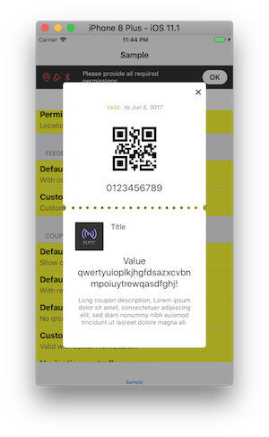
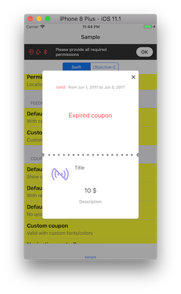
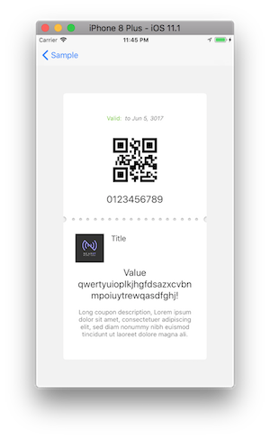
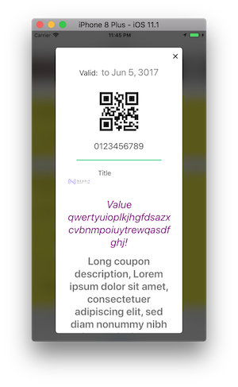

# NearIt-UI for coupon detail pop-up
#### Basic example
If you want your app to display a coupon in a beautiful pop-up dialog, use this simple code:

Swift version
```swift
 // ...
let vc = NITCouponViewController(coupon: coupon)
vc.show()
```

Objc version
```objc
 // ...
NITCouponViewController *vc = [[NITCouponViewController alloc] initWithCoupon:coupon];
[vc show];
```

where, `coupon` is an instance of NearIT SDK `Coupon` class. Further information on coupons and other in-app content can be found [here](http://nearit-android.readthedocs.io/en/latest/in-app-content/).

Some examples:





#### Advanced examples
NearIT-UI is shipped with our brand as icon placeholder. If you need to replace it just add one line of code:

```swift
// ...
vc.iconPlaceholder = ...
```

Please, keep in mind that the icon should be a square: a different aspect-ratio can potentially break the layout.

Optionally, you can display the coupon in your `UINavigationController`:

Swift version
```swift
// ...
let vc = NITCouponViewController(coupon: coupon)
vc.show(navigationController: navigationController!)
```




#### UI Customizations

Almost all aspect of the coupon UI can be customized



Swift code
```swift
let vc = NITCouponViewController(coupon: coupon)
vc.separatorImage = UIImage(named: "Line")
vc.separatorBackgroundColor = .white
vc.couponValidColor = .black
vc.validFont = UIFont.systemFont(ofSize: 18.0)
vc.fromToFont = UIFont.systemFont(ofSize: 22.0)
vc.descriptionFont = UIFont.boldSystemFont(ofSize: 25.0)
vc.valueFont = UIFont.italicSystemFont(ofSize: 25.0)
vc.valueColor = .purple
vc.iconPlaceholder = UIImage(named: "MyPlaceHolder")
vc.show(fromViewController: nil) { (dialogController: NITDialogController) in
    dialogController.backgroundStyle = .blur
}
```

Please refer to the main source code for the complete list of public variables.