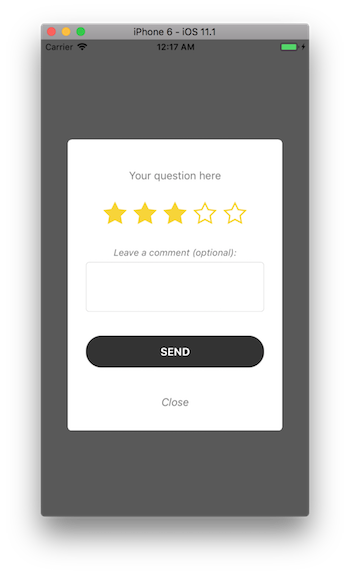

# NearIt-UI for feedback request pop-up
#### Basic example
If you want your app to display a feedback request in a beautiful pop-up dialog, use this simple code:

Swift version:
```swift
// ...
let vc = NITFeedbackViewController(feedback: feedback)
vc.show()
```

Objc version:
```objc
// ...
NITFeedbackViewController *vc = [[NITFeedbackViewController alloc] initWithFeedback:feedback];
[vc show];
```

where, `feedback` is an instance of NearIT SDK `Feedback` class. Further information on coupons and other in-app content can be found [here](http://nearit-android.readthedocs.io/en/latest/in-app-content/).



The Feedback UI also takes care of delivering the user response to the SDK library and showing the proper success or failure status of the user action.

#### Advanced examples
If you need to simplify the feedback request you are able to ask the user for the 1 to 5 rating only, without any textual comment (please notice that the text response is optional in every scenerio), you can hide the text box:

Swift version:
```swift
// ...
let vc = NITFeedbackViewController(feedback: feedback)
vc.commentVisibility = .hidden
```

Objc version:
```objc
// ...
NITFeedbackViewController *vc = [[NITFeedbackViewController alloc] initWithFeedback:feedback];
vc.commentVisibility = NITFeedbackCommentVisibilityHidden;
```

The default behaviour on tap `send` can be customized to allow complex scenarios where the user has to code some specific business logic with the rating (ie: to send the user rating to a custom backed). 
Once the custom behavior is used the feedback **won't be processed by NearIT SDK** unless explicitly coded:

```swift
vc.feedbackSendCallback = { (vc: NITFeedbackViewController, rating: Int, comment: String?, chain: @escaping (Bool) -> Void) -> Void in
    // optionally, process the event
    let manager = NITManager.default()
    let event = NITFeedbackEvent.init(feedback: feedback, rating: currentRating, comment: comment ?? "")
    manager.sendEvent(with: event, completionHandler: { (error: Error?) in
        // do your own stuff
        [...]
        chain(error != nil)
    })
}
```

`chain(true)` to continue with the success dialog, `chain(false)` to show a retry button. 

## UI Customization

Please refer to the main source code for the complete list of public variables.

Swift version:
```swift
let vc = NITFeedbackViewController(feedback: feedback)
vc.sendButton = sendButton
vc.rateEmptyButton = redEmptyButton
vc.rateFullButton = redButton
vc.commentDescriptionText = "Anything to say?"
vc.closeText = "Not interested"
vc.sendText = "Rate"
vc.textColor = UIColor.black
vc.okText = "Thank you for taking the time to provide us with your feedback.\n\nYour feedback is important to us and we will endeavour to respond to your feedback within 100 working days.\n\nIf your feedback is of an urgent nature, you can contact the Developer on +800HackerMenn"
vc.textFont = UIFont.boldSystemFont(ofSize: 15.0)
vc.errorFont = UIFont.boldSystemFont(ofSize: 20.0)
vc.disappearTime = 2.0
vc.show(fromViewController: nil) { (dialogController: NITDialogController) in
    dialogController.backgroundStyle = .blur
}
```