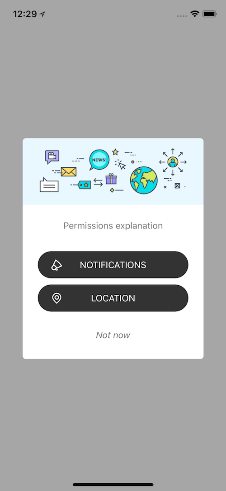

# NearIt-UI for permissions request
If your app integrates NearIT services, you surely want your user to grant your app location and notification permissions. 

#### Basic example
If you want your app to ask user for both location and bluetooth permissions (and turning both on), use the following code:

Swift version:
```swift
    let controller = NITPermissionsViewController()
    controller.show()
```

Objc version:
```objc
    NITPermissionsViewController *controller = [[NITPermissionsViewController alloc] init];
    [controller show];
```



In this basic example, both location and notifications are required to be granted and turned on: you can check if the request succeded or failed using the delegate protocol 
`NITPermissionsViewControllerDelegate`

Swift version:
```swift
optional func dialogClosed(locationGranted: Bool, notificationsGranted: Bool)
```

Objc version:
```objc
- (void)dialogClosedWithLocationGranted:(BOOL)locationGranted notificationsGranted:(BOOL)notificationsGranted;
```

#### Requiring the Presence of Location Services in an iOS App

[Apple documentation](https://developer.apple.com/library/content/documentation/UserExperience/Conceptual/LocationAwarenessPG/CoreLocation/CoreLocation.html#//apple_ref/doc/uid/TP40009497-CH2-SW1)

 To build trust between the user and an app, an app that uses Core Location must include the `NSLocationAlwaysUsageDescription` or `NSLocationWhenInUseUsageDescription` key in its `Info.plist` file and set the value of that key to a string that describes how the app intends to use location data. If you call the `NITPermissionViewController` method without including one of these keys, the system ignores your request.

Example:

```plist
	<key>NSLocationAlwaysAndWhenInUseUsageDescription</key>
	<string>Always and when in use: Your location is used for general purpose</string>
	<key>NSLocationAlwaysUsageDescription</key>
	<string>Always usage: Your location is used for general purpose</string>
	<key>NSLocationWhenInUseUsageDescription</key>
	<string>When in use: Your location is used for general purpose</string>
```

#### Note about Bluetooth
NearIT supports the use of Beacon technology, but bluetooth on iOS is a global setting and therefore can not be expicitly requested by an app.

#### Advanced examples
You can customize the permissions request controller to request location or notifications only.

Swift version:
```swift
    let vc = NITPermissionsViewController()
    vc.type = .locationOnly
    vc.locationType = .always
    vc.show()
```

Objc version:
```objc
    NITPermissionsViewController *vc = [[NITPermissionsViewController alloc] init];
    vc.type = NITPermissionsTypeLocationOnly;
    vc.locationType = NITPermissionsLocationTypeAlways;
    [vc show];
```

## UI Customization

The UI can be fully customized. Please to main source code for the complete list of public variables.

Swift version
```swift
    let vc = NITPermissionsViewController()
    vc.headerImage = UIImage(named: "header")
    vc.textColor = .black
    vc.isEnableTapToClose = true
    vc.unknownButton = UIImage(named: "button")
    vc.grantedButton = UIImage(named: "button")
    vc.grantedIcon = UIImage(named: "icon")
    vc.locationText = "Turn on location"
    vc.notificationsText = "Turn on notications"
    vc.explainText = "We'll notify you of content that's interesting"
    vc.autoCloseDialog = .on
    vc.show { (dialogController: NITDialogController) in
        dialogController.backgroundStyle = .blur
    }
```

Objc version
```
    NITPermissionsViewController *vc = [[NITPermissionsViewController alloc] init];
    vc.delegate = self;
    vc.type = NITPermissionsTypeLocationOnly;
    vc.locationType = NITPermissionsLocationTypeAlways;
    vc.headerImage = [UIImage imageNamed:@"header"];
    vc.textColor = [UIColor blackColor];
    vc.isEnableTapToClose = TRUE;

    [...]

    [vc showWithConfigureDialog:^(NITDialogController *dialogController) {
        dialogController.backgroundStyle = CFAlertControllerBackgroundStyleBlur;
    }];
```
