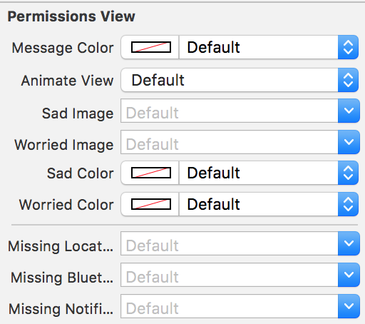

# NearIt-UI for missing permissions alert

Your app should ask the user to grant location permission, notifications and to turn the bluetooth on (if your use case implies beacons).

If you want to show a persistent bar that alert the user if any permission is missing, this library provides a convenient `NITPermissionsView`.
This bar visually specifies what is missing and will automatically hide itself when every permission has been granted.


The bar can be allocated by code or added using the Interface Builder.

Swift example:
```swift
override func viewDidLoad() {
    super.viewDidLoad()

    let permissionView = NITPermissionsView.init(frame: CGRect.zero)
    self.view.addSubview(permissionView)

    NSLayoutConstraint.activate([
        permissionView.leftAnchor.constraint(equalTo: self.view.leftAnchor),
        permissionView.rightAnchor.constraint(equalTo: self.view.rightAnchor),
        permissionView.topAnchor.constraint(equalTo: self.view.safeAreaLayoutGuide.topAnchor),
    ])
}
```

Objc example:
```objc
- (void)viewDidLoad {
    [super viewDidLoad];

    NITPermissionsView *permissionView = [[NITPermissionsView alloc] initWithFrame:CGRectZero];
    [self.view addSubview:permissionView];

    [permissionView.leftAnchor constraintEqualToAnchor:self.view.leftAnchor].active = TRUE;
    [permissionView.rightAnchor constraintEqualToAnchor:self.view.rightAnchor].active = TRUE;
    [permissionView.topAnchor constraintEqualToAnchor:self.view.safeAreaLayoutGuide.topAnchor].active = TRUE;
}
```

#### Interface builder instructions

##### Step 1: add an empty UIView in your view controller

The view must have an height of 50 points but any width, position it according to your UI


##### Step 2: configure a custom class for the view

Use class `NITPermissionsView` and Module `NearUIBinding`


##### Step 3: customize the look



Not all properties can be edited by IB, plese refer to the main source code for the complete list of customizations variables.

##### Step 4: set-up constraints 

Anchor the view to the left, right, and top sides


#### Step 5: configure the intrinsic size 

IB requires an height to properly resolve all constraints; **do not add an height constraints or the auto-hide functionality may stop working** instead configure the view as a placeholder of intrinsic size with **height 50**


## Customization

The bar can be customized to show only a subset of permissions

```swift
let permissionView = NITPermissionsView.init(frame: CGRect.zero)
permissionView.permissionsRequired = .locationAndNotifications
```

When asking for location permission, you can customize the minimum grant level (*.always* or *.whenInUse*) for the permission to be considered granted. This will influence both the permission bar and permission dialog behavior. The default value is *.always*.

```swift
permissionView.locationType = .always
```

While the default behavior on button tap is to show the default `NITPermissionViewController`, a custom callback can be provided:

```swift
permissionView.callbackOnPermissions = { (view) in
    let vc = NITPermissionsViewController()
    vc.autoCloseDialog = .on
    vc.delegate = view

    vc.show { (dialogController: NITDialogController) in
        dialogController.backgroundStyle = .blur
    }
}
```

More UI customizations

```swift
permissionView.backgroundColor = .gray
permissionView.messageColor = .black
permissionView.messageFont = UIFont.boldSystemFont(ofSize: 15.0)
permissionView.permissionAvailableColor = .green
permissionView.permissionNotAvailableColor = .red
permissionView.buttonText = "Roger"
permissionView.buttonColor = .white
permissionView.buttonFont = UIFont.italicSystemFont(ofSize: 20.0)
permissionView.buttonBackgroundImage = UIImage(named: "custom-button")
```

